# Plants vs Insects: Garden Siege

[← Back to catalog](../README.md)

This page is **not** a ChinaCode listing. It is a separate found game.

| | |
|---|---|
| **Full title** | Plants vs Insects: Garden Siege |
| **Genre** | Lane-defence strategy · async PvP |
| **Status** | In development |
| **Platform** | Android first (7.0+), iOS to follow |
| **Roster** | 41 plants · 23 insects · 64 units in the Garden Codex |
| **Scale** | Up to 6 lanes at max village · 24-hour team wars |
| **Site** | https://pvi-website-eosin.vercel.app/#/ |
| **Source** | Official product site, not ChinaCode / GameCode88 |

## Summary

Garden Siege is a lane-defence game with a garden you keep. Plants hold the columns. Insects come down the road. A lost raid costs resources and trophies, not the layout you built.

The closest comparison is Plants vs. Zombies lane clarity plus Clash of Clans-style async raids. Attackers pick lanes, queue order, and release timing. The fight then auto-resolves on a 20-tick-per-second clock. Defenders do not need to be online.

A raid is four phases and about three minutes: scout the snapshot, deploy insects, watch the sim, then read stars, loot, and a replay.

## How it plays

1. **Scout (15–30s)** — study the defender snapshot, loot, and trophies at risk.
2. **Deploy** — assign insects to lanes, set queue order, release them. Three active per lane, two seconds between releases.
3. **Battle** — auto sim. Each plant picks the closest target in its own lane, unless it is anti-air and something is flying.
4. **Result** — zero to three stars, server-checked loot, replay saved from the action log.

Village level is the master gate. It does not only inflate stats — it adds lanes and planting columns:

| Village | Lanes | Columns | Board |
|---|---:|---:|---|
| 1–3 | 3 | 2 | Meadow Basic |
| 4–6 | 4 | 3 | Meadow Standard (multiplayer unlocks) |
| 7–9 | 5 | 4 | Overgrown |
| 10–14 | 5 | 5 | Canopy |
| 15–20 | 6 | 6 | Ancient Grove |

## Modes

- **Story Mode** — five chapters, eight to ten stages each. Teaches counters. Unlocks most plants.
- **Multiplayer Raids** — attack a real player’s village snapshot. Trophy matchmaking, revenge, loot capped at 30–50% of unprotected storage.
- **Gold Cup Season** — daily Swiss pairings after clan membership freezes. 2 points a win; near-equal teams draw.
- **Team Match** — 24-hour war. Three-layer formations of 5 or 10. Front must fall before middle, middle before back. Two attacks per seated member.

## Economy

Five resources: **Photosynthesis** (buildings and plant levels), **Seeds** (plant unlocks), **Nectar** (insect levels), **Chitin** (insect unlocks), **Pollen** (speed-ups and cosmetics). Attackers steal from unprotected storage only. A vault and a reserve floor stay.

## Stills

Official art and UI stills from the product site.

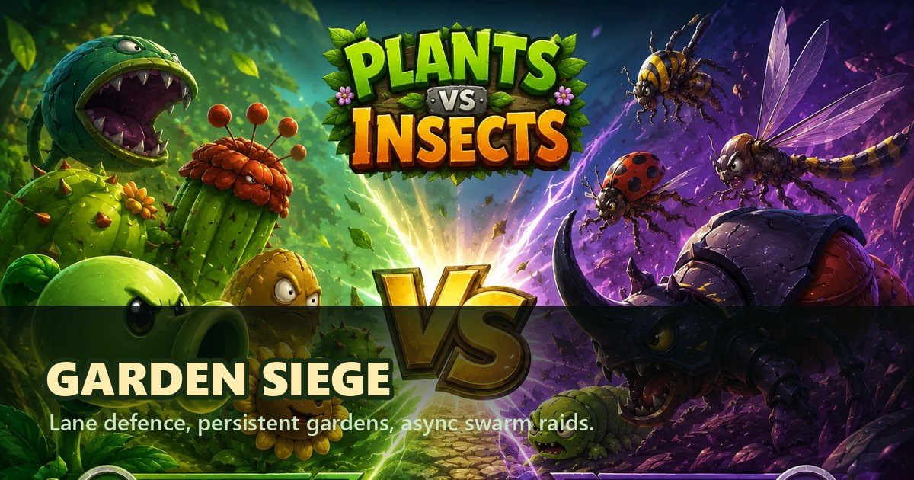
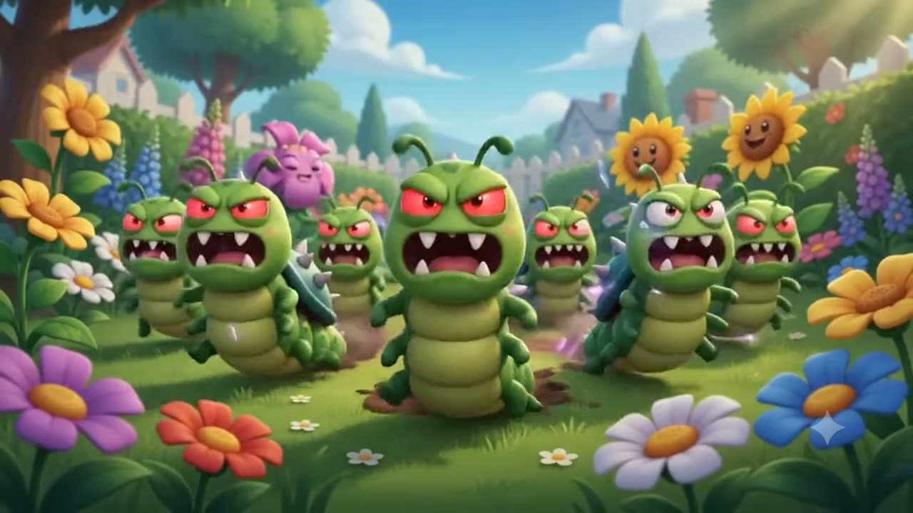

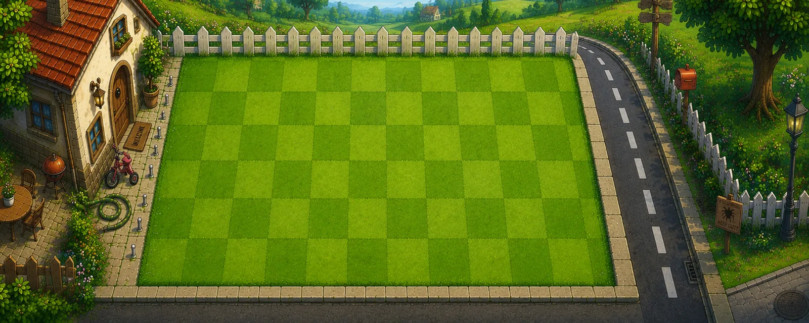
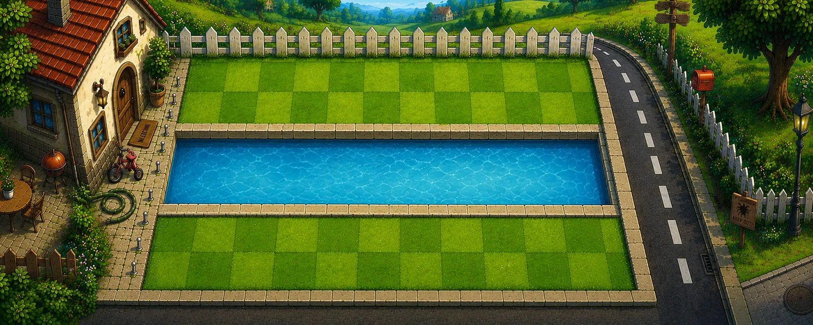
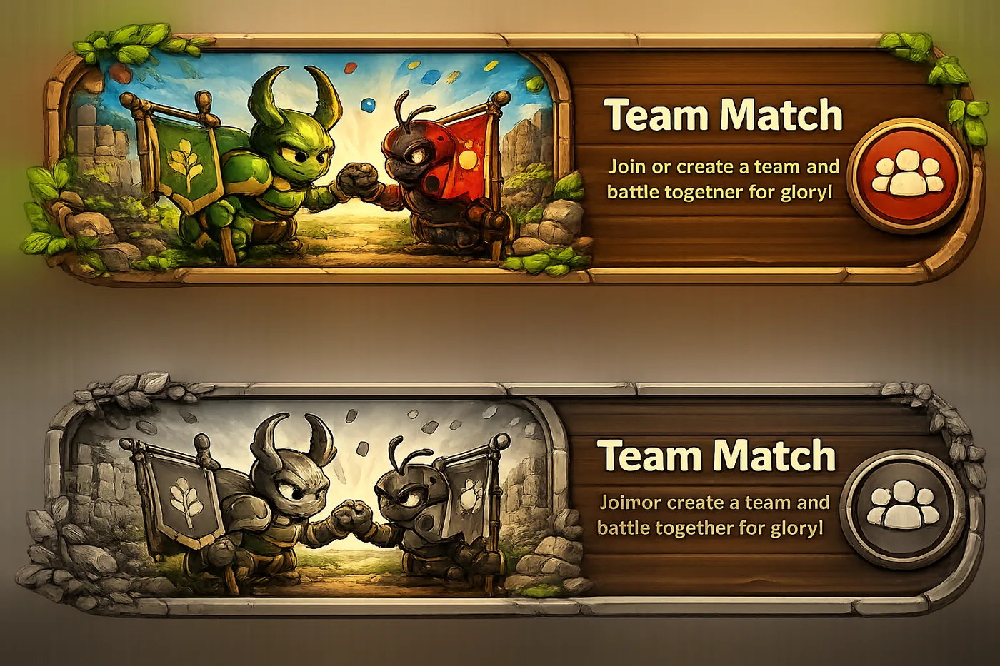
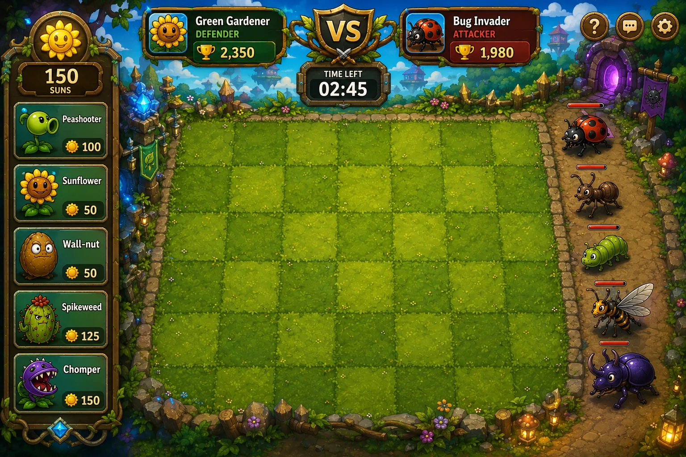
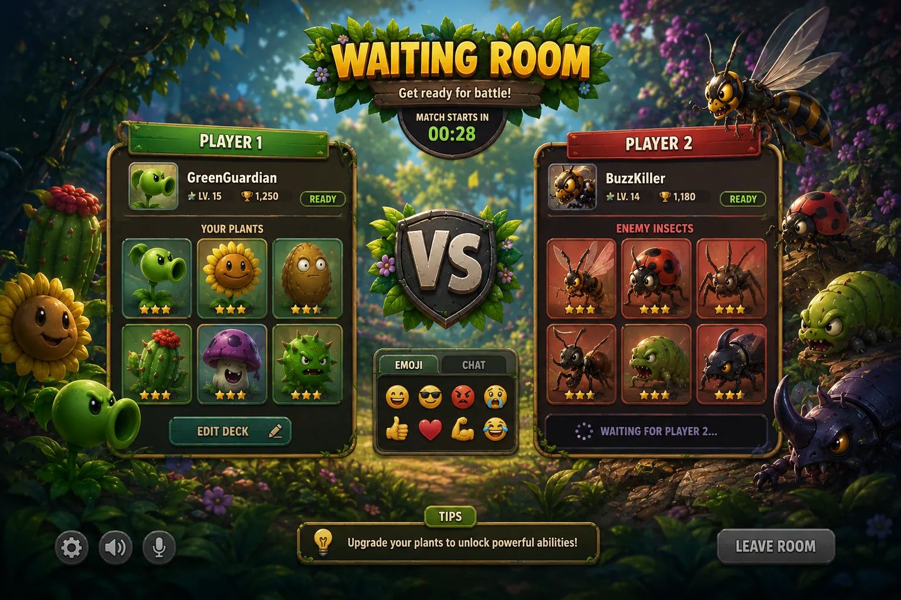
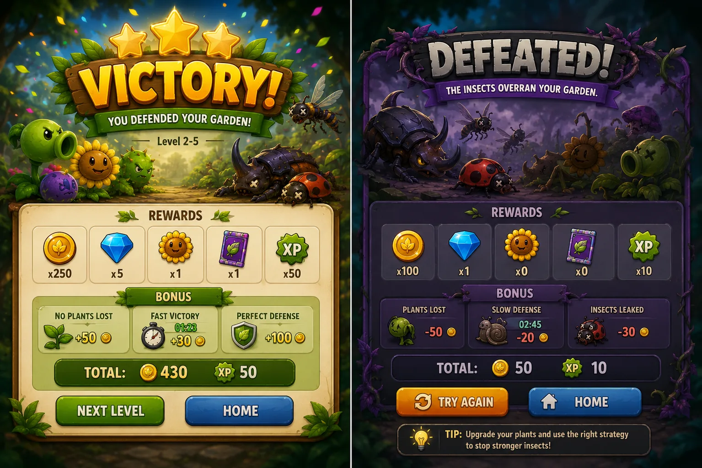
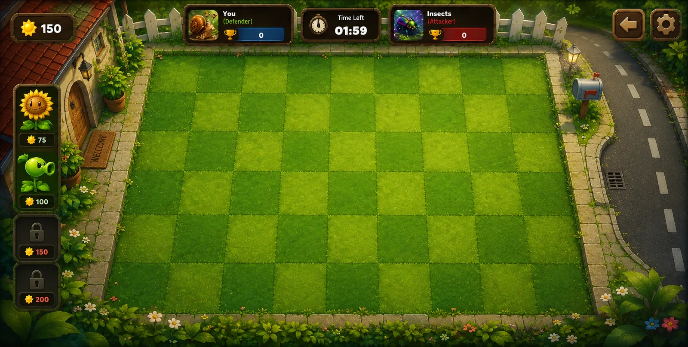
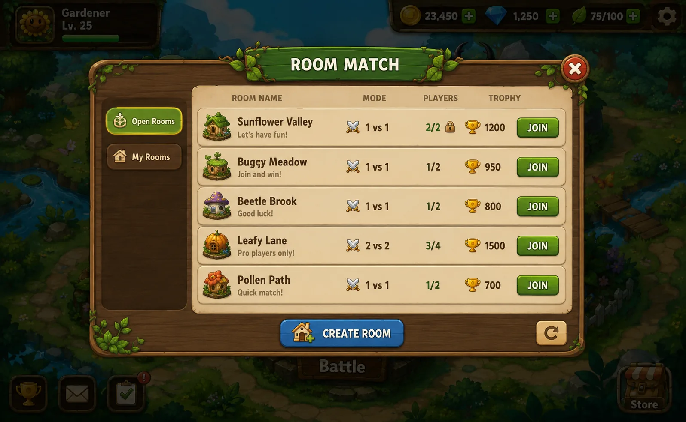
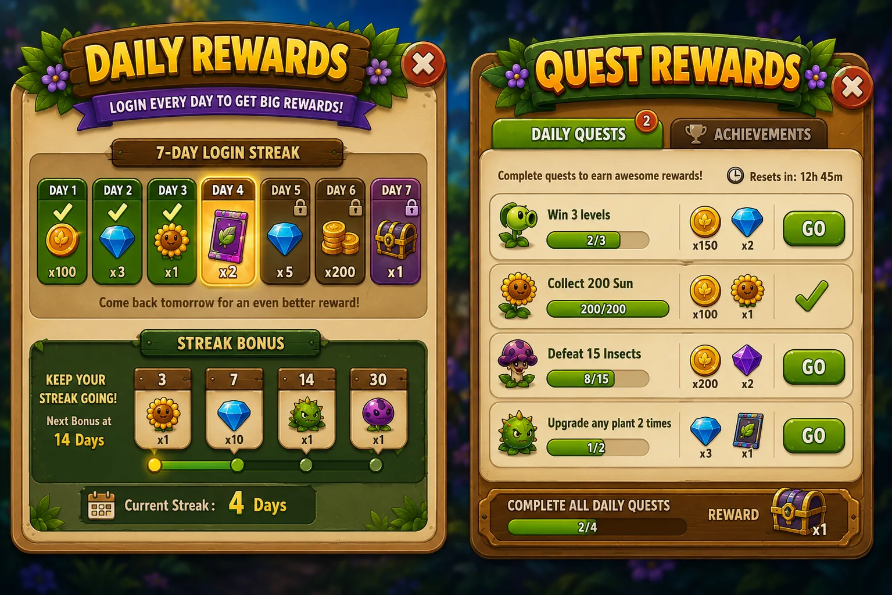
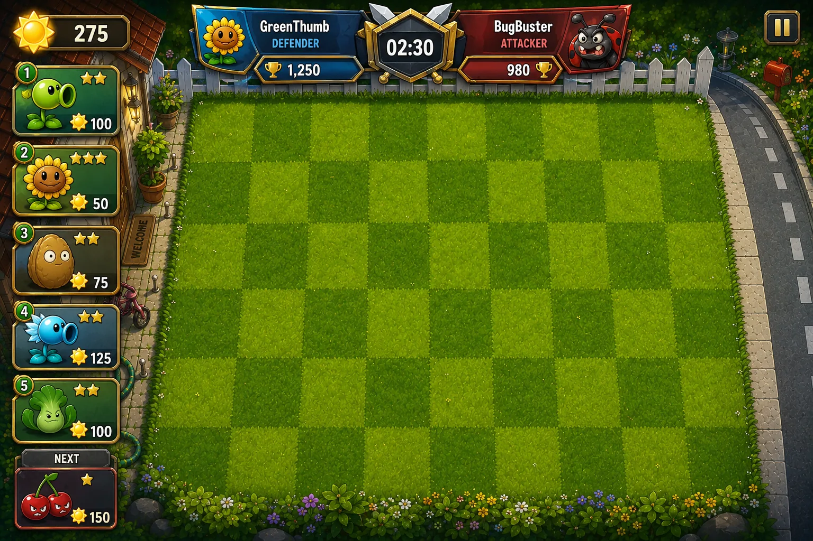
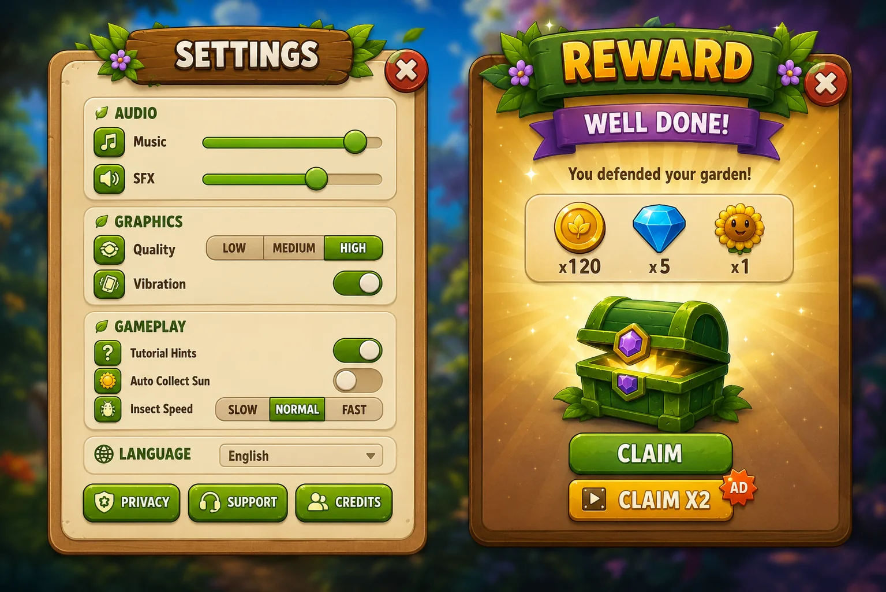

