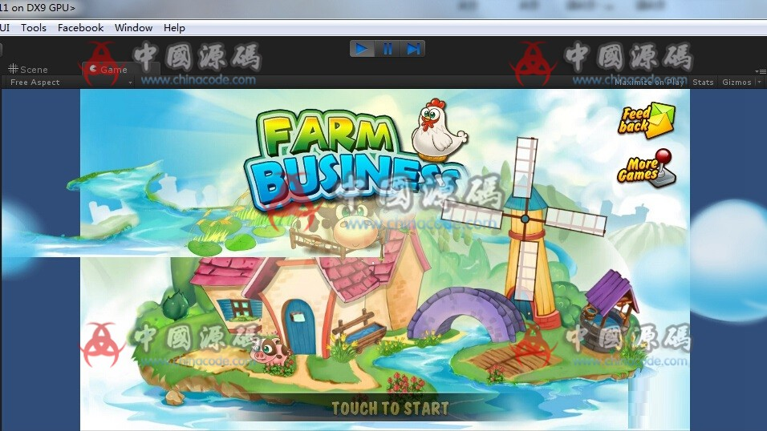
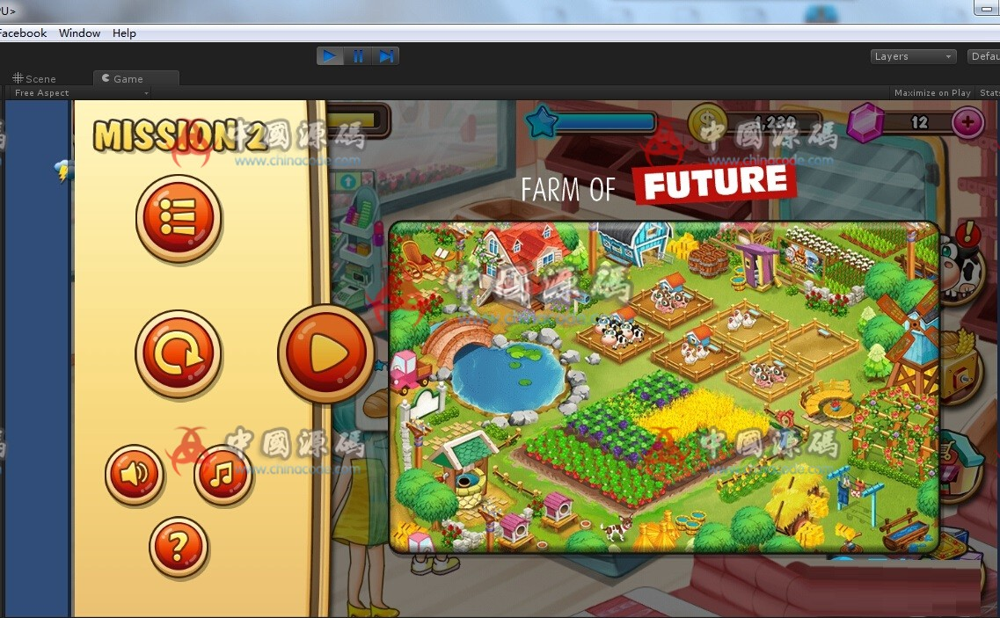
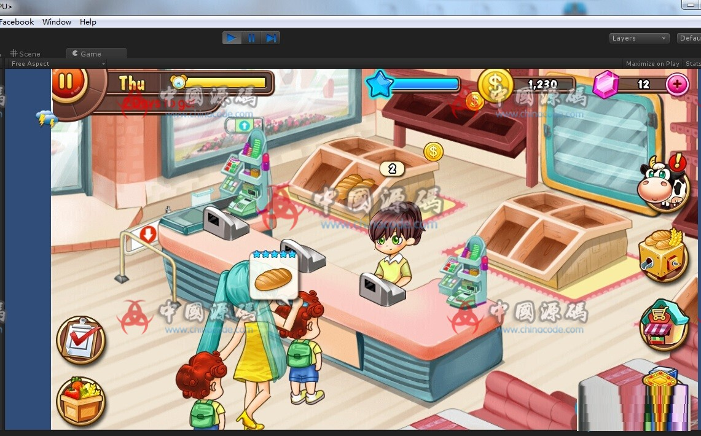
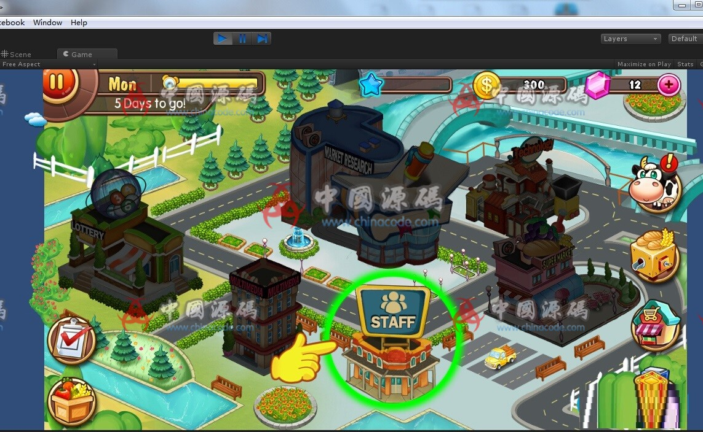

# 1. Farm Business

[← Back to catalog](../README.md)

| | |
|---|---|
| **Also known as** | Farm / city / factory tycoon |
| **Genre** | Farm sim + management |
| **Stack** | Unity 3D · mobile |
| **Access** | VIP membership (RMB amount unpublished) |
| **Views / downloads** | ~2,821 views · 72 downloads |
| **Listing** | https://www.chinacode.com/10440.html |
| **On GameCode88?** | No |

## Summary

A level-based farm tycoon, not an open MMO. One session is a business plan: grow and harvest, mill the crop in factories, hire clerks for shops, and finish the mission before the clock or resource budget runs out.

Four systems share one economy — field, factory, shop, labor — which makes this the closest ChinaCode match to a Hay Day / farm-empire template. Presentation is a cartoon island with house, windmill, pond nets, wheat fields, and a top HUD for weekday, coins, and gems.

This is a complete casual template, not a live-ops SLG. Some listing stills were captured inside the Unity editor (Scene / Game tabs visible). That does not change the gameplay; it means the package is shown as a developer project.

## Stills

