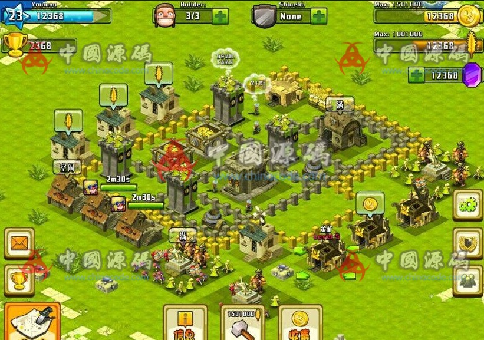

# 2. Tribal War / 部落战争

[← Back to catalog](../README.md)

| | |
|---|---|
| **Also known as** | Village builder + raid strategy |
| **Genre** | Strategy + base management |
| **Stack** | Cocos2d-x client, Java server, SQL |
| **Package** | ~1.4 GB unzipped, with docs |
| **Access** | VIP membership (RMB amount unpublished) |
| **Views / downloads** | ~2,791 views · 52 downloads |
| **Listing** | https://www.chinacode.com/12399.html |
| **On GameCode88?** | No |

## Summary

A Clash of Clans-lineage village: gold and elixir collectors, walls, archer towers, army camps, a builder count, a shield, and a bottom “attack / build” bar. The listing still is a real base — collectors show idle / full, timers, and a player named Youmou at level 23.

Life-sim depth is thin. The “life” layer is the village layout. The strategy layer is raid and defense. The package’s selling point on ChinaCode is completeness (client + Java server + SQL + written docs), not original IP.

Shipping a near-clone of Clash of Clans is a legal risk. Use this page as a catalog reference only.

ChinaCode published one large gameplay still. Related-post thumbnails on that page belong to other games and are not used here.

## Stills

