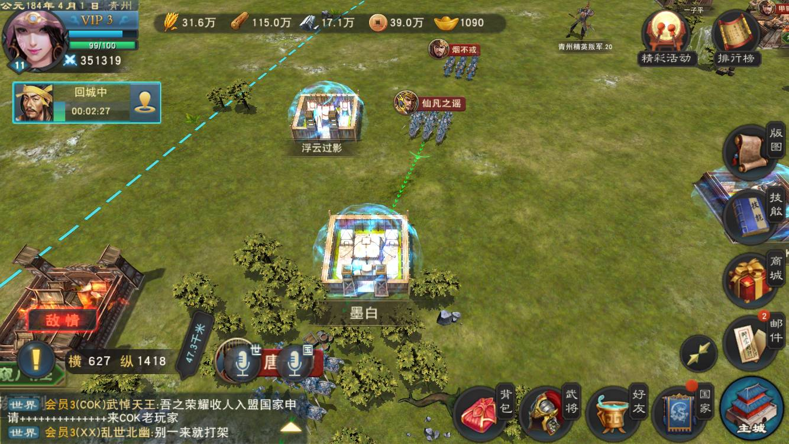
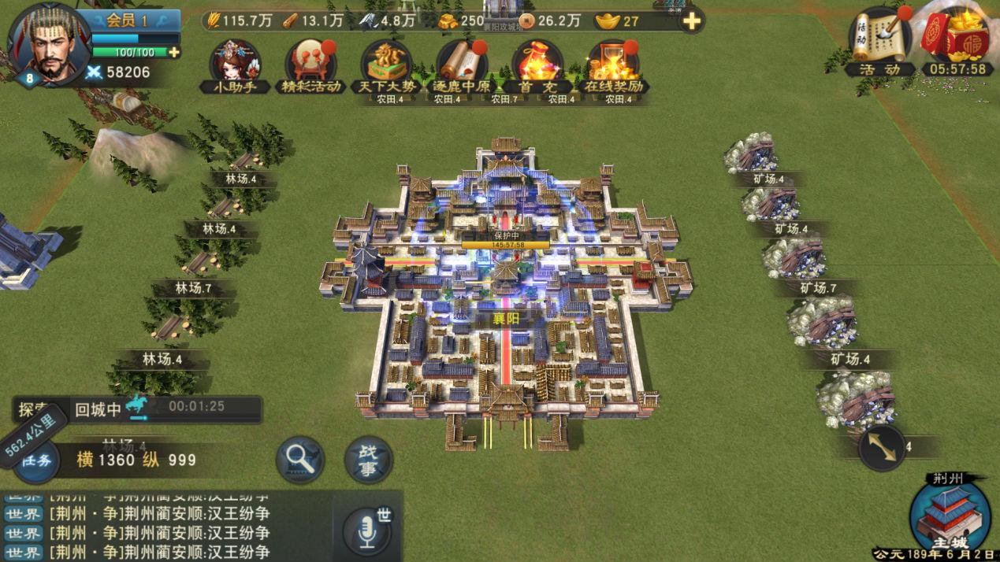

# 3. Han Wang Fen Zheng / 汉王纷争

[← Back to catalog](../README.md)

| | |
|---|---|
| **Also known as** | NetEase Three Kingdoms city-lord SLG |
| **Genre** | Strategy + city management |
| **Origin** | NetEase commercial title |
| **Package** | ~5 GB 7z |
| **Access** | **Quarterly or yearly VIP only** — standard VIP cannot download |
| **Views / downloads** | ~2,754 views · 54 downloads |
| **Listing** | https://www.chinacode.com/10560.html |
| **On GameCode88?** | No |

## Summary

The player is a city lord in AD 184. The map still shows grain, wood, iron, silver, gold, a VIP badge, marching armies, peace shields on starter cities, and a “returning to city” timer. That is the standard mobile SLG loop: gather, train, march, take land, push toward Luoyang.

This is war-first, with city 经营 as the engine that feeds the war. It is not a cozy life sim. The listing also includes NetEase key art (“Strategy Reformer / NetEase’s first historical-deduction mobile game”).

Treat the whole listing as a commercial dump, not a clean-room template. Shipping a reskin would be a copyright problem.

## Stills

