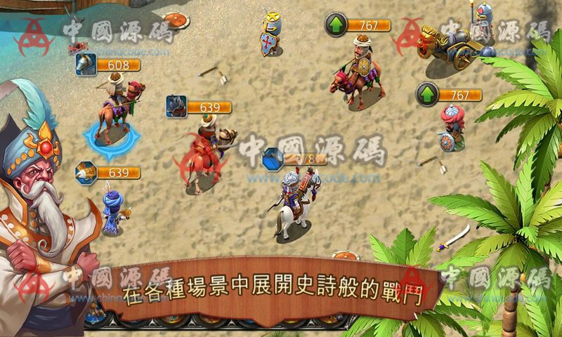

# 4. Kingdoms & Lords / 王国霸主

[← Back to catalog](../README.md)

| | |
|---|---|
| **Also known as** | 国与王 · Gameloft |
| **Genre** | Village life + turn-based strategy |
| **Stack** | C++ client and server, Android and iOS, PSD art |
| **Package** | ~3.2 GB |
| **Access** | VIP membership (RMB amount unpublished) |
| **Views / downloads** | ~2,730 views · 46 downloads |
| **Listing** | https://www.chinacode.com/5689.html |
| **On GameCode88?** | No |

## Summary

Gameloft’s dual-genre design is why this title sits so high on the list. At home it is a cartoon medieval village sim: crops, animals, buildings, taxes. In the field it is turn-based army combat with troop stacks (camel cavalry, numbered units, a siege piece, a hero portrait). The story is a quiet village threatened by barbarians, then the Dark King.

Among these ten, this is one of the few that truly mixes daily economy with tactical battles. The ChinaCode page posted one battle still.

This is a named commercial Gameloft title. Catalog reference only — not a license to reskin.

## Stills

