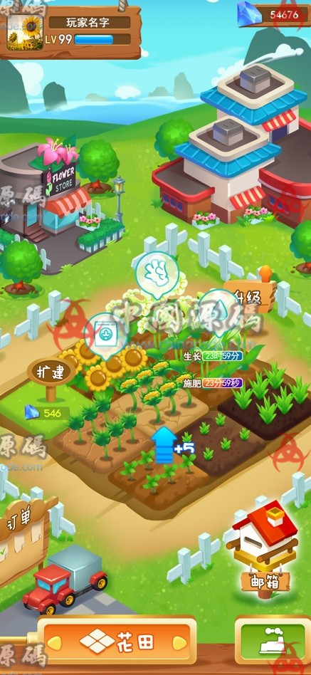
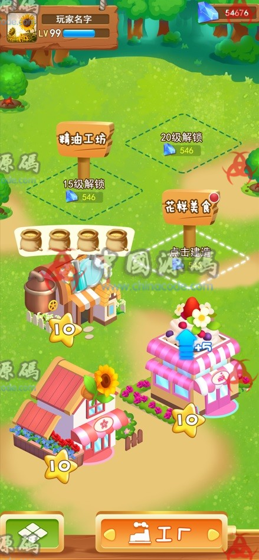
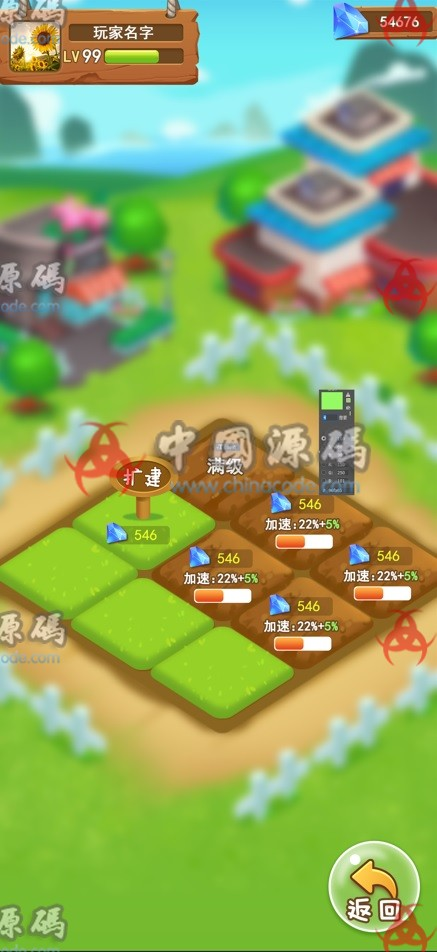

# 5. Happy Farm / 开心农场

[← Back to catalog](../README.md)

| | |
|---|---|
| **Also known as** | Greenhouse / 花房 |
| **Genre** | Life sim + farm raising |
| **Stack** | Laya client, PHP server, plus design docs |
| **Platform** | H5 / WeChat / browser |
| **Access** | VIP membership (RMB amount unpublished) |
| **Views / downloads** | ~2,580 views · 44 downloads |
| **Listing** | https://www.chinacode.com/12611.html |
| **On GameCode88?** | No |

## Summary

A social greenhouse farm in the Happy Farm / QQ Farm tradition. Plots show growth timers (“23 hours 59 minutes”), watering, fertilizing, a glove harvest icon, a flower shop, a mailbox, an order board with a delivery truck, and diamond-priced land expansion. Player HUD in the stills is LV 99 with a large gem stack — a late-game or GM preview.

Strategy is light (timers, layout, spend gems to skip). Management is the farm itself. The H5 stack (Laya + PHP) is aimed at WeChat / browser, not a native 3D app. Planning documents are included, which is uncommon on this catalog.

## Stills

