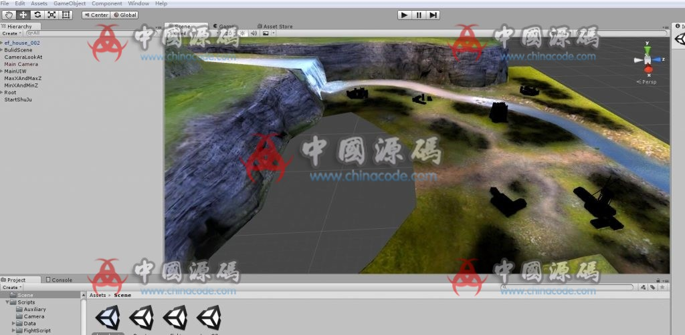

# 6. First Empire OL / 第一帝国 OL

[← Back to catalog](../README.md)

| | |
|---|---|
| **Also known as** | 3D Western-realism war SLG |
| **Genre** | War MMO + inner-city politics |
| **Stack** | Unity |
| **Style** | European realistic 3D |
| **Access** | VIP membership (RMB amount unpublished) |
| **Views / downloads** | ~2,411 views · 24 downloads |
| **Listing** | https://www.chinacode.com/5803.html |
| **On GameCode88?** | No |

## Summary

A fortress-to-fortress war MMO with a civic track: lord stats, branch cities, political choices. Heroes sit in six races with distinct skills. Combat is real-time auto-resolved, so the player watches trained units rather than micromanaging every soldier.

Life-sim content is the inner-city / politics layer meant to balance the military layer. Heavier than the idle tycoons. The listing posted one wide still.

## Stills

