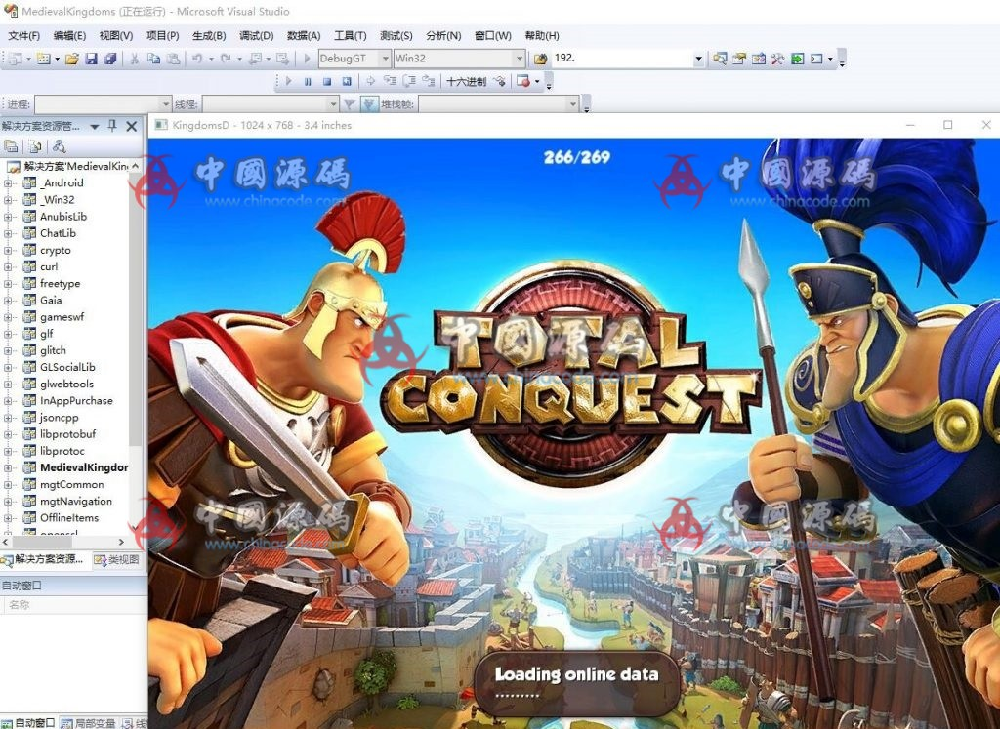
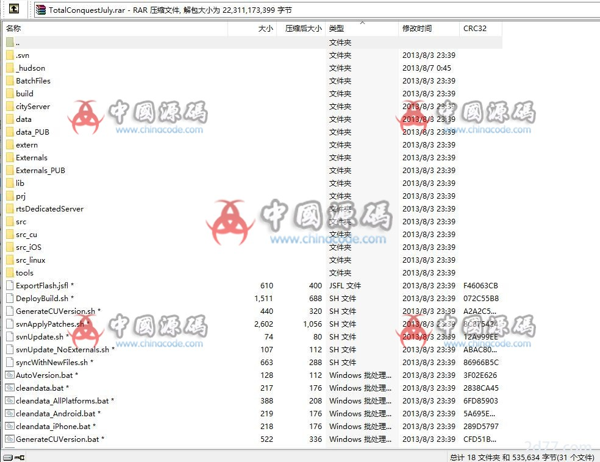

# 7. Total Conquest / 全面征服

[← Back to catalog](../README.md)

| | |
|---|---|
| **Also known as** | Gameloft Roman governor strategy MMO |
| **Genre** | City-state strategy + PvP |
| **Publisher** | Gameloft |
| **Setting** | Roman Empire after Caesar |
| **Access** | VIP membership (RMB amount unpublished) |
| **Views / downloads** | ~2,205 views · 67 downloads |
| **Listing** | https://www.chinacode.com/5295.html |
| **On GameCode88?** | No |

## Summary

After Caesar, the player is a Roman governor: walls, towers, traps, gates, garrisoned units, ten unit types, a solo campaign, then legion PvP. Management is the province. Strategy is the war. Social hooks (Facebook / Google+ in the original store copy) are typical of that generation of Gameloft SLGs.

This is closer to a kingdom MMO than to a farm. It stays on the list because city development is a first-class loop, not a skin on a battle-only game.

Named Gameloft commercial title. Catalog reference only.

## Stills

