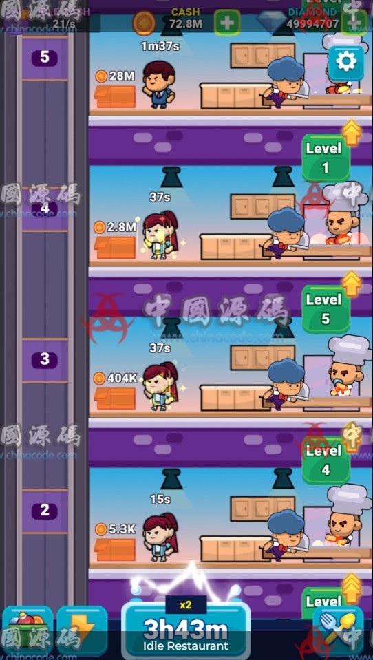
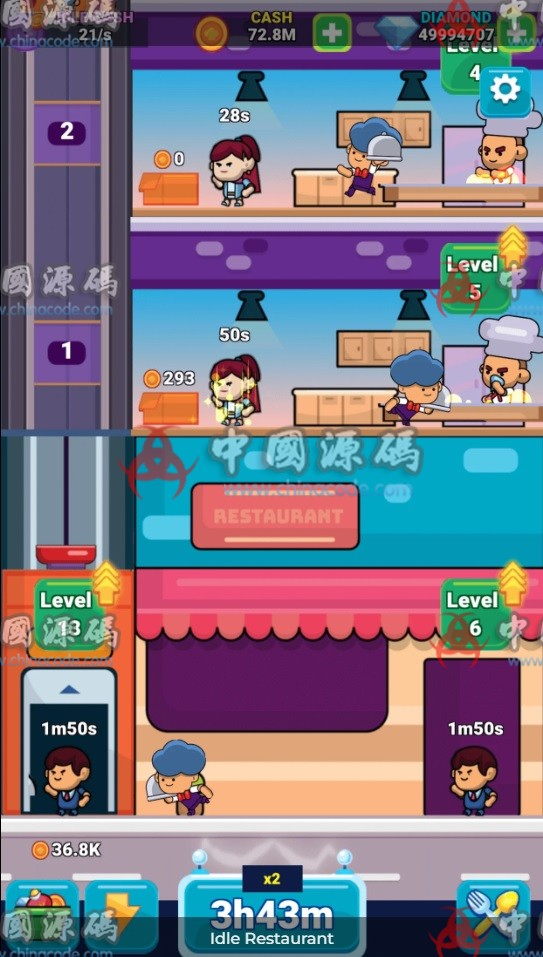

# 8. Idle Restaurant

[← Back to catalog](../README.md)

| | |
|---|---|
| **Also known as** | Idle Miner / restaurant-floor tycoon |
| **Genre** | Idle management + workplace |
| **Stack** | Unity 2019.x with AdMob, Unity Ads, IAP, Firebase |
| **Access** | VIP membership (RMB amount unpublished) |
| **Views / downloads** | ~1,992 views · 18 downloads |
| **Listing** | https://www.chinacode.com/13666.html |
| **On GameCode88?** | No |

## Summary

A vertical idle tycoon: stacked kitchen floors, a chef, a waiter, a manager, an elevator, per-floor upgrade buttons, cash in the millions, and a long idle-boost timer (“3h43m ×2”).

This is a reskin template. The listing text says to swap graphics and ad IDs, then publish. Strategy is upgrade-path optimization, not war. If the goal is an original casual tycoon, this is one of the more reusable mechanical references — provided the art is replaced.

## Stills

