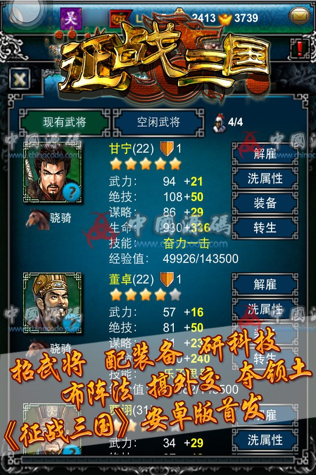

# 9. Conquest of Three Kingdoms / 征战三国

[← Back to catalog](../README.md)

| | |
|---|---|
| **Also known as** | Capture a city, then manage and expand |
| **Genre** | SLG + city 经营 |
| **Setting** | Late Han / Three Kingdoms |
| **Loop** | Win city → develop → expand |
| **Access** | VIP membership (RMB amount unpublished) |
| **Views / downloads** | ~1,867 views · 29 downloads |
| **Listing** | https://www.chinacode.com/5670.html |
| **On GameCode88?** | No |

## Summary

Opens with the Yellow Turban fight, then splits time between inner-city management and outward conquest. The listing still is a general-management screen: Gan Ning, Dong Zhuo, Jia Xu, stats (martial, skill, strategy, HP), and buttons for dismiss, reroll attributes, equip, and rebirth. Overlay text lists the systems: recruit generals, gear, tech, formations, diplomacy, take territory.

That roster screen is the management layer. The war layer is implied by the feature list rather than shown in extra map shots — ChinaCode only posted this one still.

## Stills

