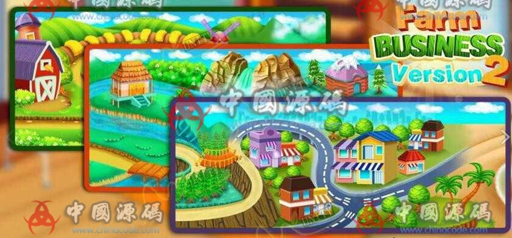
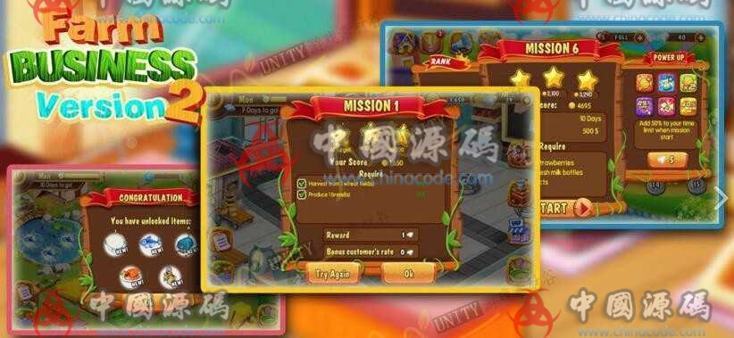
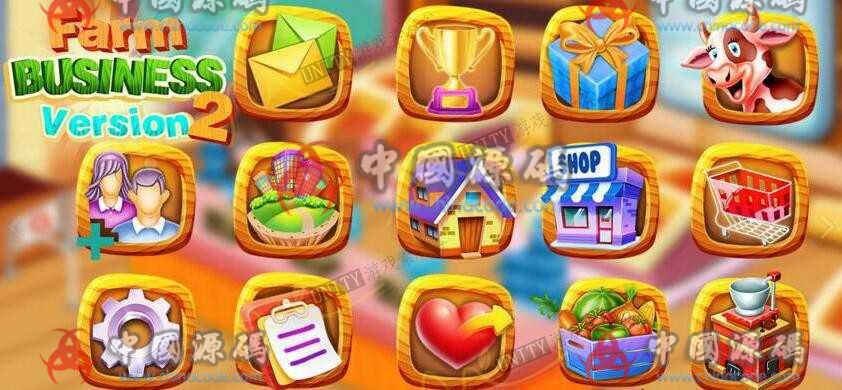

# 10. Farm Business 2

[← Back to catalog](../README.md)

| | |
|---|---|
| **Also known as** | Sequel with malls, ads, and IAP |
| **Genre** | Farm sim + management |
| **Stack** | Unity 5.5.6 |
| **Content** | ~50 extra levels, shopping centres |
| **Access** | VIP membership (RMB amount unpublished) |
| **Views / downloads** | ~1,864 views · 16 downloads |
| **Listing** | https://www.chinacode.com/12791.html |
| **On GameCode88?** | No |

## Summary

Same production-chain fantasy as Farm Business 1, with more levels and city buildings: supermarket, advertising (leaflets, TV, internet, radio), market-research NPCs, a Sunday lottery, achievements, and a technology building. Facebook share, ads, and IAP are already wired.

A title-collage image was dropped because it is marketing art, not a playable HUD. Remaining stills are in-game views.

## Stills

